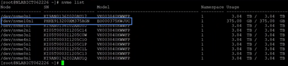

= 更换 HPE DL360 的驱动器
:allow-uri-read: 
:icons: font
:imagesdir: ../media/

[role="lead"]
从此处列出的过程中进行选择，以主动更换驱动器，在驱动器出现故障后更换驱动器以及更换缓存驱动器。更换 SolidFire ESDS 集群中的元数据驱动器或块驱动器。Element UI * 集群 > 驱动器 * 页面显示了驱动器损耗信息。

* <<Replace a drive proactively>>
* <<Replace a faulty drive>>
* <<Replace a cache drive>>

== 主动更换驱动器

如果要主动更换 SolidFire ESDS 集群中的元数据驱动器或块驱动器，请执行此操作步骤。Element UI * 集群 * > * 驱动器 * 页面显示了驱动器损耗信息。

.您需要什么？ #8217 ；将需要什么
* 在 NetApp Element 软件 UI 中，确保集群运行状况良好，并且没有警告或集群故障。您可以使用主集群节点的管理虚拟 IP （ MVIP ）地址访问 Element UI 。
* 确保集群上没有正在运行的活动作业。
* 确保您已熟悉所有步骤。
* 请确保采取必要的预防措施，防止在处理驱动器时发生静电放电（ ESD ）。

.步骤
. 在 Element UI 中执行以下步骤：
+
.. 在 Element UI 中，选择 * 集群 * > * 驱动器 * > * 活动 * 。
.. 选择要更换的驱动器。
.. 记下驱动器的序列号。这将有助于您在节点的 IPMI 接口（此处为 HPE Integrated Lights-Out 或 ILO ）中找到相应的贝 ID 。
.. 选择 * 批量操作 * > * 删除 * 。删除驱动器后，该驱动器将进入 * 正在删除 * 状态。它会在一段时间内保持 * 正在删除 * 状态，等待驱动器上的数据同步或重新分配到集群中的其余驱动器。删除完成后，驱动器将移至 * 可用 * 状态。

. 执行以下步骤，找到要更换的驱动器的驱动器插槽：
+
.. 登录到节点的 IPMI 接口（此处为 ILO ）。
.. 从左侧导航栏中选择 * 系统信息 * ，然后选择 * 存储 * 。
.. 将您在上一步中记下的序列号与屏幕上显示的序列号进行匹配。
.. 根据序列号查找列出的插槽编号。这是必须从中删除驱动器的物理插槽。

. 确定驱动器后，按如下所示物理方式将其卸下：
+
.. 确定驱动器托架。
+
下图显示了服务器的正面，图左侧显示了驱动器托架编号：

+
image::../media/esds_drive_bay.png[显示了 DL360 节点上的驱动器托架编号。]

.. 按要更换的驱动器上的电源按钮。LED 闪烁 5-10 秒并停止。
.. 在 LED 停止闪烁且驱动器已关闭后，按下红色按钮并拉动闩锁，将其从服务器中卸下。
+

NOTE: 请确保您非常小心地处理驱动器。

+
物理移除驱动器后， Element UI 中的驱动器状态将更改为 * 故障 * 。

. 在 Element UI 中，选择 * 集群 * > * 驱动器 * > * 故障 * 。
. 选择 * 操作 * 下的图标，然后选择 * 删除 * 。
+
现在，您可以继续在节点中安装新驱动器。

. 记下新驱动器的序列号。
. 插入替代驱动器，方法是使用闩锁小心地将驱动器推入托架并合上闩锁。正确插入驱动器后，驱动器将通电。
. 执行以下步骤以验证 ILO 中的新驱动器详细信息：
+
.. 登录到 ILO 。
.. 选择 * 信息 * > * 集成管理日志 * 。您将看到为添加的驱动器记录的事件。
.. 从左侧导航栏中选择 * 系统信息 * ，然后选择 * 存储 * 。
.. 滚动查看，直到找到有关更换驱动器的托架的信息。
.. 验证屏幕上的序列号是否与您更换的新驱动器的序列号匹配。

. 将新驱动器信息添加到更换了该驱动器的节点的 `sf_sSD_config.yaml` 文件中。
+
`sf_sSD_config.yaml` 文件存储在 ` /opt/sf/` 中。此文件包含有关节点中驱动器的所有信息。每次更换驱动器时，您都必须在此文件中输入更换驱动器信息。有关此文件的详细信息，请参见 link:reference_esds_sf_sds_config_file.html["sf_sSD_config.yaml 文件的内容"^]。

+
.. 使用 PuTTY 与节点建立 SSH 连接。
.. 在 PuTTY 配置窗口的 * 主机名（或 IP 地址） * 字段中输入节点 MIP 。
.. 选择 * 打开 * 。
.. 在打开的终端窗口中，使用您的用户名和密码登录。
.. 运行 ` # cat /opt/sf/sf_sSD_config.yaml` 命令以列出文件的内容。
.. 将已替换驱动器的 `dataDevices` 或 `cachDevices` 列表中的条目替换为新驱动器信息。
.. 运行 ` # systemctl start solidfire-update-drives` 。
+
运行此命令后，您会看到 Bash 提示符。之后，您应转到 Element UI 将驱动器添加到集群中。Element UI 将显示可用新驱动器的警报。

. 选择 * 集群 * > * 驱动器 * > * 可用 * 。
+
您将看到您安装的新驱动器的序列号。

. 选择 * 操作 * 下的图标，然后选择 * 添加 * 。
. 块同步作业完成后，刷新 Element UI 。如果您从 Element UI 的 * 报告 * 选项卡访问 * 正在运行的任务 * 页面，则会看到有关可用驱动器的警报已清除。

== 更换故障驱动器

如果 SolidFire ESDS 集群中的驱动器出现故障， Element UI 将显示警报。从集群中删除驱动器之前，请查看节点 / 服务器 IPMI 接口中的信息，以验证故障原因。如果要更换块驱动器或元数据驱动器，则这些步骤适用。

.您需要什么？ #8217 ；将需要什么
* 从 NetApp Element 软件 UI 中，验证驱动器是否出现故障。Element 会在驱动器出现故障时显示警报。您可以使用主集群节点的管理虚拟 IP （ MVIP ）地址访问 Element UI 。
* 确保您已熟悉所有步骤。
* 请确保采取必要的预防措施，防止在处理驱动器时发生静电放电（ ESD ）。

.步骤
. 使用 Element UI 按如下所示从集群中删除故障驱动器：
+
.. 选择 * 集群 * > * 驱动器 * > * 故障 * 。
.. 记下与故障驱动器关联的节点名称和序列号。
.. 选择 * 操作 * 下的图标，然后选择 * 删除 * 。如果您看到与此驱动器关联的服务警告，请等待托箱同步完成，然后删除此驱动器。

. 执行以下步骤以验证驱动器故障并查看与驱动器故障相关的已记录事件：
+
.. 登录到节点的 IPMI 接口（此处为 ILO ）。
.. 选择 * 信息 * > * 集成管理日志 * 。此处列出了驱动器故障的原因（例如， SSDWearOut ）和位置。您还可以看到一个事件，指出驱动器的状态为已降级。
.. 从左侧导航栏中选择 * 系统信息 * ，然后选择 * 存储 * 。
.. 验证有关故障驱动器的可用信息。故障驱动器的状态将显示为 * 已降级 * 。

. 按如下所示物理卸下驱动器：
+
.. 确定机箱中的驱动器插槽编号。
+
下图显示了服务器的正面，图左侧显示了驱动器托架编号：

+
image::../media/esds_drive_bay.png[显示了 DL360 节点上的驱动器托架编号。]

.. 按要更换的驱动器上的电源按钮。LED 闪烁 5-10 秒并停止。
.. 在 LED 停止闪烁且驱动器已关闭后，按下红色按钮并拉动闩锁，将其从服务器中卸下。
+

NOTE: 请确保您非常小心地处理驱动器。

. 插入替代驱动器，方法是使用闩锁小心地将驱动器推入托架并合上闩锁。正确插入驱动器后，驱动器将通电。
. 在 ILO 中验证新驱动器详细信息：
+
.. 选择 * 信息 * > * 集成管理日志 * 。您会看到为添加的驱动器记录的事件。
.. 刷新页面以查看为您添加的新驱动器记录的事件。

. 在 ILO 中验证存储系统的运行状况：
+
.. 从左侧导航栏中选择 * 系统信息 * ，然后选择 * 存储 * 。
.. 滚动查看，直到找到有关安装新驱动器的托架的信息为止。
.. 记下序列号。

. 将新驱动器信息添加到更换了该驱动器的节点的 `sf_sSD_config.yaml` 文件中。
+
`sf_sSD_config.yaml` 文件存储在 ` /opt/sf/` 中。此文件包含有关节点中驱动器的所有信息。每次更换驱动器时，您都必须在此文件中输入更换驱动器信息。有关此文件的详细信息，请参见 link:reference_esds_sf_sds_config_file.html["sf_sSD_config.yaml 文件的内容"^]。

+
.. 使用 PuTTY 与节点建立 SSH 连接。
.. 在 PuTTY 配置窗口的 * 主机名（或 IP 地址） * 字段中输入节点 MIP 。
.. 选择 * 打开 * 。
.. 在打开的终端窗口中，使用您的用户名和密码登录。
.. 运行 ` # cat /opt/sf/sf_sSD_config.yaml` 命令以列出文件的内容。
.. 将已替换驱动器的 `dataDevices` 或 `cachDevices` 列表中的条目替换为新驱动器信息。
.. 运行 ` # systemctl start solidfire-update-drives` 。
+
运行此命令后，您会看到 Bash 提示符。之后，您应转到 Element UI 将驱动器添加到集群中。Element UI 将显示可用新驱动器的警报。

. 选择 * 集群 * > * 驱动器 * > * 可用 * 。
+
您将看到您安装的新驱动器的序列号。

. 选择 * 操作 * 下的图标，然后选择 * 添加 * 。
. 块同步作业完成后，刷新 Element UI 。如果您从 Element UI 的 * 报告 * 选项卡访问 * 正在运行的任务 * 页面，则会看到有关可用驱动器的警报已清除。

== 更换缓存驱动器

如果要更换 SolidFire ESDS 集群中的缓存驱动器，请执行此操作步骤。缓存驱动器与元数据服务相关联。Element UI * 集群 * > * 驱动器 * 页面显示了驱动器损耗信息。

.您需要什么？ #8217 ；将需要什么
* 在 NetApp Element 软件 UI 中，确保集群运行状况良好，并且没有警告或集群故障。您可以使用主集群节点的管理虚拟 IP （ MVIP ）地址访问 Element UI 。
* 确保集群上没有正在运行的活动作业。
* 确保您已熟悉所有步骤。
* 确保从 Element UI 中删除元数据服务。
* 请确保采取必要的预防措施，防止在处理驱动器时发生静电放电（ ESD ）。

.步骤
. 在 Element UI 中执行以下步骤：
+
.. 在 Element UI 中，选择 * 集群 * > * 节点 * > * 活动 * 。
.. 记下要更换缓存驱动器的节点的节点 ID 和管理 IP 地址。
.. 如果缓存驱动器运行状况良好且您要主动更换它，请选择 * 活动驱动器 * ，找到元数据驱动器并将其从 UI 中删除。
+
删除后，元数据驱动器将首先进入 * 正在删除 * 状态，然后进入 * 可用 * 状态。

.. 如果在缓存驱动器出现故障后执行更换，则元数据驱动器将处于 * 可用 * 状态，并列在 * 集群 * > * 驱动器 * > * 可用 * 下。
.. 在 Element UI 中，选择 * 集群 * > * 驱动器 * > * 活动 * 。
.. 选择与 NodeName 关联的元数据驱动器，以便在其中更换缓存驱动器。
.. 选择 * 批量操作 * > * 删除 * 。删除驱动器后，该驱动器将进入 * 正在删除 * 状态。它会在一段时间内保持 * 正在删除 * 状态，等待驱动器上的数据同步或重新分配到集群中的其余驱动器。删除完成后，驱动器将移至 * 可用 * 状态。

. 执行以下步骤，找到要更换的缓存驱动器的驱动器插槽：
+
.. 登录到节点的 IPMI 接口（此处为 ILO ）。
.. 从左侧导航栏中选择 * 系统信息 * ，然后选择 * 存储 * 。
.. 找到缓存驱动器。
+

NOTE: 缓存驱动器的容量小于存储驱动器。

.. 查找列出的缓存驱动器插槽编号。这是必须从中删除驱动器的物理插槽。

. 确定驱动器后，按如下所示物理方式将其卸下：
+
.. 确定驱动器托架。
+
下图显示了服务器的正面，图左侧显示了驱动器托架编号：

+
image::../media/esds_drive_bay.png[显示了 DL360 节点上的驱动器托架编号。]

.. 按要更换的驱动器上的电源按钮。LED 闪烁 5-10 秒并停止。
.. 在 LED 停止闪烁且驱动器已关闭后，按下红色按钮并拉动闩锁，将其从服务器中卸下。
+

NOTE: 请确保您非常小心地处理驱动器。

+
物理移除驱动器后， Element UI 中的驱动器状态将更改为 * 故障 * 。

. 记下新缓存驱动器的 HPE 型号和 ISN （序列号）。
. 插入替代驱动器，方法是使用闩锁小心地将驱动器推入托架并合上闩锁。正确插入驱动器后，驱动器将通电。
. 执行以下步骤以验证 ILO 中的新驱动器详细信息：
+
.. 登录到 ILO 。
.. 选择 * 信息 * > * 集成管理日志 * 。您会看到为添加的驱动器记录的事件。
.. 从左侧导航栏中选择 * 系统信息 * ，然后选择 * 存储 * 。
.. 滚动查看，直到找到有关更换驱动器的托架的信息。
.. 验证屏幕上的序列号是否与您安装的新驱动器的序列号匹配。

. 在更换了此驱动器的节点的 `sf_sSD_config.yaml` 文件中添加新的缓存驱动器信息。
+
`sf_sSD_config.yaml` 文件存储在 ` /opt/sf/` 中。此文件包含有关节点中驱动器的所有信息。每次更换驱动器时，您都应在此文件中输入更换驱动器信息。有关此文件的详细信息，请参见 link:reference_esds_sf_sds_config_file.html["sf_sSD_config.yaml 文件的内容"^]。

+
.. 使用 PuTTY 与节点建立 SSH 连接。
.. 在 PuTTY 配置窗口的 * 主机名（或 IP 地址） * 字段中，输入节点 MIP 地址（您先前在 Element UI 中记下了该地址）。
.. 选择 * 打开 * 。
.. 在打开的终端窗口中，使用您的用户名和密码登录。
.. 运行 `nvme list` 命令以列出 NMVe 设备。
+
您可以查看新缓存驱动器的型号和序列号。请参见以下示例输出：

+

.. 在 ` /opt/sf/sf_sSD_config.yaml` 中添加新缓存驱动器信息。
+
您应将现有缓存驱动器型号和序列号替换为新缓存驱动器的相应信息。请参见以下示例：

+
image::../media/esds_cache_drive_info.png[显示了型号和序列号。]

.. 保存 ` /opt/sf/sf_sSD_config.yaml` 文件。

. 针对您适用的场景执行以下步骤：
+
[cols="2*"]
|===
| 场景 | 步骤 

| 运行 `nvme list` 命令后，新插入的缓存驱动器将显示出来  a| 
.. 运行 ` # systemctl restart SolidFire` 。此过程大约需要三分钟。
.. 运行 `ssystem status SolidFire` 检查 SolidFire` 的状态。
.. 转至步骤 9. 。

| 运行 `nvme list` 命令后，新插入的缓存驱动器不会显示出来  a| 
.. 重新启动节点。
.. 重新启动节点后，通过登录到节点（使用 PuTTY ）并运行 `ssystem status SolidFire` 命令来验证 SolidFire` 服务是否正在运行。
.. 转至步骤 9. 。

|===
+

NOTE: 重新启动 SolidFire` 或重新启动节点会导致一些集群故障，这些故障最终会在大约五分钟后清除。

. 在 Element UI 中，重新添加已删除的元数据驱动器：
+
.. 选择 * 集群 * > * 驱动器 * > * 可用 * 。
.. 选择操作下的图标，然后选择 * 添加 * 。

. 块同步作业完成后，请刷新 Element UI 。
+
您可以看到，有关可用驱动器的警报已清除，并出现其他集群故障。

== 了解更多信息

* https://www.netapp.com/data-storage/solidfire/documentation/["NetApp SolidFire 资源页面"^]
* https://docs.netapp.com/sfe-122/topic/com.netapp.ndc.sfe-vers/GUID-B1944B0E-B335-4E0B-B9F1-E960BF32AE56.html["早期版本的 NetApp SolidFire 和 Element 产品的文档"^]

