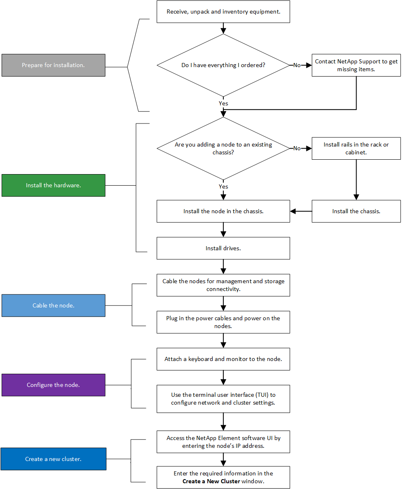
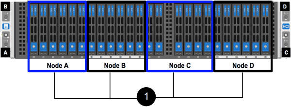

= 安装 H 系列存储节点
:allow-uri-read: 
:icons: font
:imagesdir: ../media/

[role="lead"]
在开始使用全闪存存储系统之前，您应正确安装和设置存储节点。

TIP: 请参见 link:../media/hseries_isi.pdf["海报"^] 以可视化方式显示说明。

*  diagrams
*  for installation
*  the rails
*  and cable the nodes
*  the nodes
*  a cluster

== 工作流图

此处的工作流图简要概述了安装步骤。根据 H 系列型号的不同，步骤略有不同。

=== H410s

=== H610S

NOTE: 对于 H610S ，术语 " 节点 " 和 " 机箱 " 可以互换使用，因为节点和机箱并非独立组件，这一点与 2U 四节点机箱不同。

image::../media/h610s_isi_workflow.png[H610S 安装工作流]

== 准备安装

在准备安装时，请清点已发送给您的硬件，如果缺少任何物品，请联系 NetApp 支持部门。

确保您的安装位置具有以下项：

* 系统的机架空间。

[cols="2*"]
|===
| 节点类型 | 机架空间 

| H410S 节点 | 双机架单元（ 2U ） 

| H610S 节点 | 一个机架单元（ 1U ） 
|===
* SFP28/SFP+ 直连缆线或收发器
* 带 RJ45 连接器的 CAT5e 或更高规格的缆线
* 用于配置系统的键盘，视频，鼠标（ KVM ）交换机
* USB 记忆棒（可选）

TIP: 随附的硬件取决于您的订购内容。新的 2U 四节点订单包括机箱，挡板，滑轨套件，驱动器，存储节点， 和电源线（每个机箱两根）。如果您订购的是 H610S 存储节点，则驱动器会安装在机箱中。

CAUTION: 安装硬件时，请确保移除设备上的所有包装材料并进行包装。这样可以防止节点过热和关闭。

== 安装导轨

发货给您的硬件订单包括一组滑轨。您需要使用螺丝刀完成导轨安装。每个节点型号的安装步骤略有不同。

TIP: 从机架底部到顶部安装硬件，以防止设备发生翻倒。如果您的机架包含稳定设备，请在安装硬件之前安装它们。

* 
* 

=== H410s

H410S 节点安装在 2U 四节点 H 系列机箱中，该机箱随附两组适配器。如果要将机箱安装在带有圆孔的机架中，请使用适用于带有圆孔的机架的适配器。H410S 节点的导轨适用于深度介于 29 英寸到 33.5 英寸之间的机架。导轨完全收缩后，其长度为 28 英寸，导轨的前后部分仅通过一个螺钉固定在一起。

CAUTION: 如果将机箱安装到完全收缩的导轨上，导轨的前，后部分可能会分开。

.步骤
. 将导轨前部与机架前柱上的孔对齐。
. 将导轨正面的挂钩推入机架前柱上的孔中，然后向下推，直到装有弹簧的销子卡入机架孔中为止。
. 使用螺钉将导轨连接到机架。下图显示了连接到机架前部的左侧导轨：
+
image::../media/h410s_rail.gif[2U 导轨安装]

. 将导轨的后部延伸至机架的后柱。
. 将导轨后部的挂钩与后部柱上的相应孔对齐，确保导轨前部和后部处于同一水平。
. 将导轨的后部安装到机架上，然后使用螺钉固定导轨。
. 对机架另一侧执行上述所有步骤。

=== H610S

以下是为 H610S 存储节点安装导轨的图示：

image::../media/h610s_rail_isi.gif[H610S 存储节点的导轨安装。]

TIP: H610S 上有左右导轨。将螺钉孔朝底部放置，以便 H610S 翼形螺钉可以将机箱固定到导轨上。

== 安装节点并为其布线

将 H410S 存储节点安装在 2U 四节点机箱中。对于 H610S ，请将机箱 / 节点直接安装到机架中的导轨上。

CAUTION: 从设备上拆下所有包装材料和包装。这样可以防止节点过热和关闭。

* 
* 

=== H410s

.步骤
. 在机箱中安装 H410S 节点。下面是安装了四个节点的机箱的背面视图示例：
+
image::../media/sf_isi_chassis_rear.png[此图显示了 2U 的背面]

+

WARNING: 抬起硬件并将其安装到机架时，请务必小心。一个空的双机架单元（ 2U ）四节点机箱重 54.45 磅（ 24.7 千克），一个节点重 8.0 磅（ 3.6 千克）。

. 安装驱动器。
+

. 为节点布线。
+

IMPORTANT: 如果机箱后部的通风孔被缆线或标签挡住，则可能会因过热而导致组件过早出现故障。

+
image::../media/hci_isi_storage_cabling.png[此图显示了 H410S 存储节点的布线。]

+
** 在端口 A 和 B 中连接两根 CAT5e 或更高规格的缆线，用于管理连接。
** 在端口 C 和 D 中连接两根 SFP28/SFP+ 缆线或收发器，用于存储连接。
** （可选，建议）在 IPMI 端口中连接一根 CAT5e 缆线，以实现带外管理连接。

. 将电源线连接到每个机箱的两个电源设备，然后将其插入 240V PDU 或电源插座。
. 启动节点。
+

NOTE: 节点启动大约需要 6 分钟。

+
image::../media/hci_poweron_isg.gif[此图显示了 2U 中节点上的电源按钮]

=== H610S

.步骤
. 安装 H610S 机箱。以下是在机架中安装节点 / 机箱的图示：
+
image::../media/h610s_chassis_isi.gif[显示了要在机架中安装的 H610S 节点 / 机箱。]

+

WARNING: 抬起硬件并将其安装到机架时，请务必小心。一个 H610S 机箱重 40.5 磅（ 18.4 千克）。

. 为节点布线。
+

IMPORTANT: 如果机箱后部的通风孔被缆线或标签挡住，则可能会因过热而导致组件过早出现故障。

+
image::../media/h600s_isi_noderear.png[此图显示了 H610S 存储节点的布线。]

+
** 使用两根 SFP28 或 SFP+ 缆线将节点连接到 10/25GbE 网络。
** 使用两个 RJ45 连接器将节点连接到 1GbE 网络。
** 在 IPMI 端口中使用 RJ-45 连接器将节点连接到 1GbE 网络。
** 将两根电源线连接到节点。

. 启动节点。
+

NOTE: 节点启动大约需要 5 分 30 秒。

+
image::../media/h600s_isi_nodefront.png[此图显示了 H610S 机箱的正面，其中突出显示了电源按钮。]

== 配置节点

将硬件装入机架并布线后，即可配置新的存储资源。

.步骤
. 将键盘和显示器连接到节点。
. 在显示的终端用户界面（ Terminal User Interface ， TUI ）中，使用屏幕导航配置节点的网络和集群设置。
+

NOTE: 您应从 TUI 获取节点的 IP 地址。将节点添加到集群时需要执行此操作。保存设置后，此节点将处于待定状态，可以添加到集群中。请参见 <insert link to Setup secance> 。

. 使用基板管理控制器（ BMC ）配置带外管理。这些步骤 * 仅适用于 H610S* 节点。
+
.. 使用 Web 浏览器导航到默认 BMC IP 地址： 192.168.0.120
.. 使用 * root * 作为用户名并使用 * calvin* 作为密码登录。
.. 在节点管理屏幕中，导航到 * 设置 * > * 网络设置 * ，然后配置带外管理端口的网络参数。

TIP: 请参见 https://kb.netapp.com/Advice_and_Troubleshooting/Hybrid_Cloud_Infrastructure/NetApp_HCI/How_to_access_BMC_and_change_IP_address_on_H610S["此知识库文章（需要登录）"]。

== 创建集群

将存储节点添加到安装中并配置新存储资源后，即可创建新的存储集群

.步骤
. 从与新配置的节点位于同一网络的客户端上，输入节点的 IP 地址以访问 NetApp Element 软件 UI 。
. 在 "* 创建新集群 "* 窗口中输入所需信息。请参见 link:../setup/concept_setup_overview.html["设置概述"^] 有关详细信息 ...

== 了解更多信息

* https://www.netapp.com/data-storage/solidfire/documentation/["NetApp SolidFire 资源页面"^]
* https://docs.netapp.com/sfe-122/topic/com.netapp.ndc.sfe-vers/GUID-B1944B0E-B335-4E0B-B9F1-E960BF32AE56.html["早期版本的 NetApp SolidFire 和 Element 产品的文档"^]

