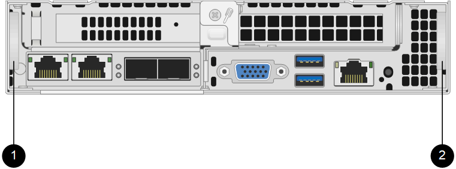

= 更换 H410S 节点
:allow-uri-read: 
:icons: font
:imagesdir: ../media/

[role="lead"]
如果 CPU 出现故障， Radian 卡出现问题，出现其他主板问题或未打开电源，则应更换存储节点。这些说明适用于 H410S 存储节点。

NetApp Element 软件 UI 中的警报会在存储节点出现故障时向您发出警报。您应使用 Element UI 获取故障节点的序列号（服务标签）。要在集群中找到故障节点，您需要此信息。

下面是一个具有四个存储节点的双机架单元（ 2U ）四节点机箱的背面：

image::hci_stornode_rear.gif[此图显示了具有四个存储节点的四节点机箱。]

下面是具有 H410S 节点的四节点机箱的正面图，其中显示了与每个节点对应的托架：

image::hci_stor_node_ssd_bays.gif[显示了与 H410S 节点的四节点机箱中的每个节点关联的托架。]

.您需要的内容
* 您已确认存储节点出现故障，需要更换。
* 您已获得替代存储节点。
* 您已佩戴静电释放（ ESD ）腕带，或者已采取其他防静电保护措施。
* 您已为连接到存储节点的每个缆线贴上标签。

下面简要概述了这些步骤：

* <<准备更换节点>>
* <<更换机箱中的节点>>
* <<将节点添加到集群>>

== 准备更换节点

在安装替代节点之前，您应在 NetApp Element 软件 UI 中从集群中正确删除故障存储节点。您可以在不造成任何服务中断的情况下执行此操作。您应从 Element UI 中获取故障存储节点的序列号，并将其与此节点背面标签上的序列号进行匹配。

.步骤
. 在 Element UI 中，选择 * 集群 * > * 驱动器 * 。
. 使用以下方法之一从节点中删除驱动器：
+
[cols="2*"]
|===
| 选项 | 步骤 

 a| 
删除单个驱动器
 a| 
.. 单击要删除的驱动器的 * 操作 * 。
.. 单击 * 删除 * 。

 a| 
删除多个驱动器
 a| 
.. 选择要删除的所有驱动器，然后单击 * 批量操作 * 。
.. 单击 * 删除 * 。

|===
. 选择 * 集群 * > * 节点 * 。
. 记下故障节点的序列号（服务标签）。您应将其与节点背面标签上的序列号进行匹配。
. 记下序列号后，请按如下所示从集群中删除此节点：
+
.. 选择要删除的节点的 * 操作 * 按钮。
.. 选择 * 删除 * 。

== 更换机箱中的节点

使用 NetApp Element 软件 UI 从集群中删除故障节点后，您可以从机箱中物理删除此节点。您应将替代节点安装在从中删除故障节点的机箱中的同一插槽中。

.步骤
. 继续操作前，请佩戴防静电保护装置。
. 打开新存储节点的包装，并将其设置在机箱附近的水平表面上。
+
将故障节点退回 NetApp 时，请保留包装材料。

. 为要移除的存储节点背面插入的每个缆线贴上标签。
+
安装新存储节点后，应将缆线插入原始端口。

+
下图显示了存储节点的背面：

+
image::../media/hci_isi_storage_cabling.png[此图显示了存储节点的布线。]

+
[cols="2*"]
|===
| Port | 详细信息 

 a| 
端口 A
 a| 
1/10GbE RJ45 端口

 a| 
端口 b
 a| 
1/10GbE RJ45 端口

 a| 
端口 c
 a| 
10/25GbE SFP+ 或 SFP28 端口

 a| 
端口 d
 a| 
10/25GbE SFP+ 或 SFP28 端口

 a| 
IPMI
 a| 
1/10GbE RJ45 端口

|===
. 断开存储节点的所有缆线。
. 向下拉节点右侧的凸轮把手，然后使用两个凸轮把手拉出节点。
+
向下拉的凸轮把手上有一个箭头，用于指示其移动的方向。另一个凸轮把手不会移动，可用于帮助您拉出节点。

+

+
[cols="2*"]
|===
| 项目 | Description 

 a| 
1.
 a| 
凸轮把手，可帮助您拉出节点。

 a| 
2.
 a| 
凸轮把手，可在拉出节点之前向下拉。

|===
+

NOTE: 将节点从机箱中拉出时，请用双手支撑节点。

. 将节点置于水平表面上。
+
您必须将节点打包并将其返回给 NetApp 。

. 将替代节点安装在机箱中的同一插槽中。
+

IMPORTANT: 确保在将节点滑入机箱时不会用力过大。

. 从已删除的节点移动驱动器，然后将其插入新节点。
. 将缆线重新连接到最初断开缆线连接的端口。
+
断开缆线连接时，缆线上的标签将有助于指导您完成此操作。

+
[NOTE]
====
.. 如果机箱后部的通风孔被缆线或标签挡住，则可能会因过热而导致组件过早出现故障。
.. 请勿将缆线强行插入端口；否则可能会损坏缆线，端口或两者。

====
+

TIP: 确保替代节点的布线方式与机箱中其他节点相同。

. 按节点正面的按钮将其打开。

== 将节点添加到集群

向集群添加节点或在现有节点中安装新驱动器时，驱动器会自动注册为可用。您必须先使用 Element UI 或 API 将驱动器添加到集群中，然后这些驱动器才能加入集群。

集群中每个节点上的软件版本都应兼容。将节点添加到集群时，集群会根据需要在新节点上安装集群版本的 Element 软件。

.步骤
. 选择 * 集群 * > * 节点 * 。
. 选择 * 待定 * 可查看待定节点列表。
. 执行以下操作之一：
+
** 要添加单个节点，请选择要添加的节点的 * 操作 * 图标。
** 要添加多个节点，请选中要添加的节点对应的复选框，然后选中 * 批量操作 * 。
+

NOTE: 如果要添加的节点的 Element 软件版本与集群上运行的版本不同，则集群会异步将此节点更新为集群主节点上运行的 Element 软件版本。更新节点后，它会自动将自己添加到集群中。在此异步过程中，节点将处于 `pendingActive` 状态。

. 选择 * 添加 * 。
+
此节点将显示在活动节点列表中。

. 从 Element UI 中，选择 * 集群 * > * 驱动器 * 。
. 选择 * 可用 * 可查看可用驱动器列表。
. 执行以下操作之一：
+
** 要添加单个驱动器，请选择要添加的驱动器的 * 操作 * 图标，然后选择 * 添加 * 。
** 要添加多个驱动器，请选中要添加的驱动器对应的复选框，选择 * 批量操作 * ，然后选择 * 添加 * 。

== 了解更多信息

* https://www.netapp.com/data-storage/solidfire/documentation/["NetApp SolidFire 资源页面"^]
* https://docs.netapp.com/sfe-122/topic/com.netapp.ndc.sfe-vers/GUID-B1944B0E-B335-4E0B-B9F1-E960BF32AE56.html["早期版本的 NetApp SolidFire 和 Element 产品的文档"^]

